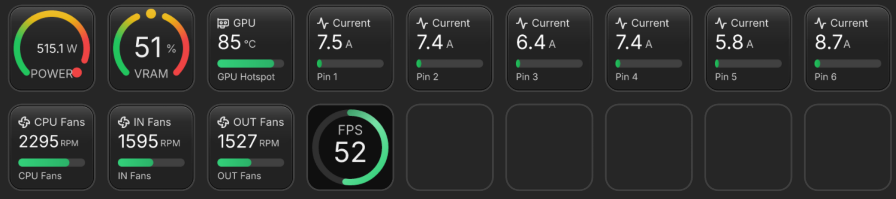

# Sho Metrics Linux

A community fork of [Sho Metrics](https://github.com/ShoMetrics/sho_metrics)
bringing its hardware sensor widgets to Linux under
[OpenDeck](https://github.com/nekename/OpenDeck), with a native Linux helper
daemon replacing the Windows-only LibreHardwareMonitor helper.

Upstream Sho Metrics supports Windows and macOS. Its author
[declined official Linux support and endorsed this independent
fork](https://github.com/ShoMetrics/sho_metrics/issues/5), so this repository
carries the Linux work while tracking upstream's releases.



## What you get

Everything Sho Metrics does: circle, gauge, bar, text, and sparkline views,
dense and stacked multi-metric keys, themes, color compensation. On Linux
the data comes from:

- **Every hwmon sensor** in `/sys/class/hwmon`: CPU (k10temp/coretemp), board
  fans and voltages (it87/nct67xx), NVMe temps, DDR5 SPD temps, and anything
  else with a driver, including exotic hardware like the
  [WireView Pro](https://github.com/emaspa/wireview-hwmon) power meter
  (per-pin 12VHPWR current on a deck key!)
- **NVIDIA GPUs via [LACT](https://github.com/ilya-zlobintsev/LACT)**: core
  temp, **hotspot**, **VRAM junction and per-chip temps** (readings NVML
  refuses to expose on Blackwell), fan RPM/PWM, power draw and limit, clocks,
  VRAM usage, utilization
- **AMD GPUs** through plain hwmon (amdgpu)
- **In-game FPS via [MangoHud](https://github.com/flightlessmango/MangoHud)**:
  FPS, 1% lows, and frametime while a MangoHud-enabled game runs
- Built-in CPU, memory, disk, network, and custom HTTP JSON metrics, plus the
  curated CPU/GPU widgets via stable aliases (`cpu.temp`, `gpu.power`, ...)

## How it works

```
Sho Metrics Linux plugin (OpenDeck)  --gRPC over unix socket-->  packages/source-linux
        |                                                               |- /sys/class/hwmon
     OpenDeck                                                           |- lactd (NVIDIA)
                                                                        |- ~/mangohud_logs
```

The plugin talks to its deep-sensor helper over the same
`MetricSourceService` gRPC contract (`contracts/proto`) the Windows helper
uses; `packages/source-linux` is the Linux implementation of that contract,
and `packages/hub` gates it on a platform capability rather than `win32`.

## Install

### 1. The plugin

Download `ShoMetrics-Linux.streamDeckPlugin` from
[Releases](https://github.com/emaspa/sho-metrics-linux/releases) and install it
through OpenDeck's plugin manager, or unzip it into
`~/.config/opendeck/plugins/`. Then restart OpenDeck.

Requirements: [OpenDeck](https://github.com/nekename/OpenDeck) 2.14+ with your
deck working, and Node.js 20+ (`node` on PATH).

### 2. The helper daemon

Arch (AUR):

```sh
paru -S sho-metrics-source-linux
```

Fedora 43 and 44 (COPR):

```sh
sudo dnf copr enable emaspa/sho-metrics
sudo dnf install sho-metrics-source-linux
```

Ubuntu 26.04 and other distros: take the `.deb`, `.rpm` or `.pkg.tar.zst`
from [Releases](https://github.com/emaspa/sho-metrics-linux/releases), or
install from a checkout of this repository:

```sh
cd packages/source-linux
./install.sh
```

The distro packages ship the systemd user unit disabled, so enable it once
(the checkout installer already does this):

```sh
systemctl --user enable --now shometrics-linux-helper.service
```

See [packages/source-linux/README.md](packages/source-linux/README.md) for
the sensor sources, MangoHud setup, and the socket path.

Optional, for NVIDIA deep sensors: `lact` with the `lactd` service enabled
(v0.10+ for Blackwell hotspot); your user must be able to read
`/run/lactd.sock` (wheel group on most distros). Optional, for FPS:
`mangohud`.

### 3. Add keys

In OpenDeck, drag **Advanced Sensor** onto a key and pick from the full
hardware tree, or use the curated CPU/GPU widgets. Gauge view lives under
View: Circle, then Variant: Gauge.

## Relationship to upstream

- `main` is a clean mirror of [ShoMetrics/sho_metrics](https://github.com/ShoMetrics/sho_metrics).
- `linux` carries the fork's changes on top of upstream release tags.
- Version scheme: fork releases are `vX.Y.Z-linux.N`, where `X.Y.Z` is the
  upstream base and `N` the fork revision. The changelog always names the
  upstream base.
- Windows and macOS behavior is untouched. The plugin keeps the historical
  `windows-helper` source id and `local:windows-helper` profile id on all
  platforms for stored-settings compatibility; Linux support is gated behind
  `supportsHelperSourceOnPlatform()` in the hub.
- The Linux packaging uses OpenDeck's `manifest.linux.json` override, so the
  base `manifest.json` stays valid against Elgato's schema.
- The plugin's UUID is `com.ez.sho-metrics-linux` and its display name is
  "Sho Metrics Linux - System Monitoring", so it cannot clobber or be
  clobbered by the official `com.ez.sho-metrics` plugin.

The Linux daemon began life in the standalone
[shometrics-linux-helper](https://github.com/emaspa/shometrics-linux-helper)
repository, which keeps the port's development history and diagnostics tools.

## Development

Linux changes live on the `linux` branch. Hub commands run from
`packages/hub`:

```sh
npm ci
npm run build
npm run test:unit          # tsc --noEmit + vitest
npm run test:pi            # property inspector suite
npm run pack:streamdeck -- --native-addon-target linux-x64 --version 0.3.0.1
```

The Linux helper daemon (`packages/source-linux`) loads the contract from
`contracts/proto` at runtime, so plugin and helper cannot drift. To run it
directly:

```sh
cd packages/source-linux
npm install
npm start
```

Upstream's contribution rules still apply to shared code:

- [CONTRIBUTING.md](CONTRIBUTING.md)
- [AGENTS.md](AGENTS.md)
- [docs/development/command-playbook.md](docs/development/command-playbook.md)

## Acknowledgements

This fork builds on [Sho Metrics](https://github.com/ShoMetrics/sho_metrics)
by ez and the open-source projects it uses: LibreHardwareMonitor, Lucide,
systeminformation, and resvg-js. The Linux side adds LACT, MangoHud, and the
hwmon kernel interface. See package-level third-party notices for license
details.

## License

GPL-3.0, matching upstream Sho Metrics. See [LICENSE](LICENSE). This is an
unofficial community fork, not affiliated with Sho Metrics or Elgato.
